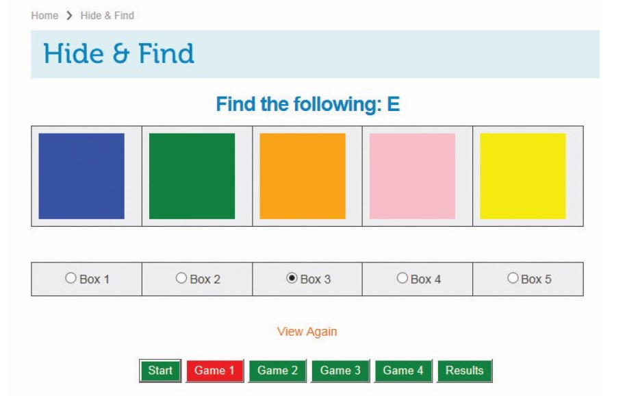

**#Wordpress Plugin**

Language: PHP, CSS, JavaScript 

Description: This plugin is a fun active game to help develop short term memory. First the user logs in giving their name and age. 
They start the game by pressing game 1, where they are give a question such as "Find the following: A" and showed a set
of five random characters between A and E in five different boxes, this is displayed for only a second and then are 
hidden from the user by coloured boxes. The user clicks a radio button under the box they think the character is hidden.
They can press view again, to uncover the boxes and view the characters again for only a second. By clicking game 2 they
move on to the next game, there is four games in all. When the user has finished game four they press end, to finish
the whole game. A popup screen tell the user if they click the result button they can see there results. The results
shows what question they were asked and what answers they had given. At the bottom of the screen they can start the
whole game again.

